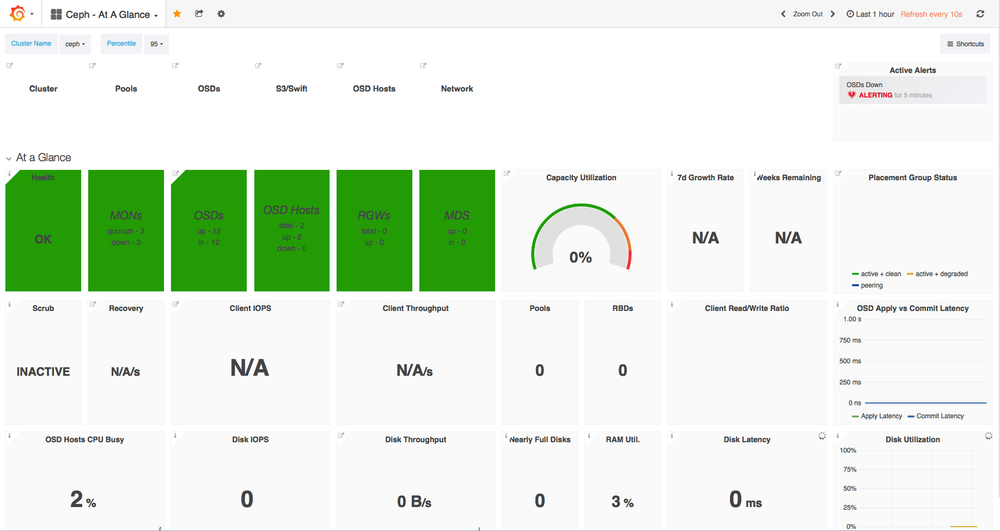
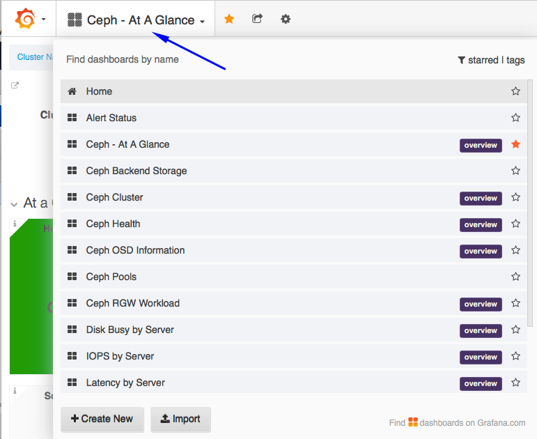

# Module - 2 : Deploying Red Hat Ceph Storage

!!! Summary "Module Agenda"
    - **In this module you will be deploying Red Hat Ceph Storage 3 cluster across 3 nodes using Ansible based deployer called ``ceph-ansible``.**
    - **Later you will deploy Ceph Metrics, an end to end monitoring system for Red Hat Ceph Storage.**
    - **By the end of this module you will have a running Red Hat Ceph Storage cluster and Ceph Metrics monitoring Dashboard.**

- From your workstation login to the ``ceph-admin`` node with the user name **``student``** [(Learn how to Login)](https://red-hat-storage.github.io/RHCS_Test_Drive/#starting-the-lab)

```
ssh student@<IP Address of ceph-admin node>
```  

!!! example "Prerequisite"
    - You must run all the commands logged in as user **student** on the **ceph-admin** node, unless otherwise specified. 

## Setting up environment for ceph-ansible  

In-order to save time ``ceph-ansible`` package has already been installed on ``ceph-admin`` node.

- Begin by creating a directory for ceph-ansible keys under ``student`` user's home directory.

```
mkdir ~/ceph-ansible-keys
```

- Create a new ansible inventory file which helps ``ceph-ansible`` to know what role needs to be applied on each node.

```
sudo vi /etc/ansible/hosts
```

- In the ``/etc/ansible/hosts`` inventory file add 
    - Ceph Monitor host name ``ceph-node[1:3]`` under ``[mons]``  section
    - Ceph OSDs host name ``ceph-node[1:3]`` under ``[osds]``  section
    - Ceph Manager host name ``ceph-admin`` under ``[mgrs]``  section
    - Ceph Client host name ``ceph-admin`` under ``[clients]``  section 

```
[mons]
ceph-node[1:3]

[osds]
ceph-node[1:3]

[mgrs]
ceph-admin

[clients]
ceph-admin
```

!!! info
    - Since this is a lab environment we are collocating Ceph Mon and Ceph OSD daemons on `ceph-node*` nodes
    - Also ``ceph-admin`` node will host Ceph Manager and Ceph Client services

- Ensure that Ansible can reach to all the cluster nodes.

```
ansible all -m ping
```

## Configuring Ceph-Ansible Settings

- Visit ``ceph-ansible`` main configuration directory

```
cd /usr/share/ceph-ansible/group_vars/
```

- In the directory you will find ``all.yml`` , ``osds.yml`` and ``clients.yml`` configuration files which are **pre-populated for you** to avoid any typographic errors. Lets look at these configuration files one by one.

!!! tip
    You can skip editing configuration files as they are pre-populated with correct settings to avoid typos and save time.

- ``all.yml`` configuration file most importantly configures
    - Ceph repository, path to RHCS ISO
    - Ceph Monitor network interface ID, public network
    - Ceph OSD backend as ``filestore`` ( In later modules you will test ``bluestore`` too )
    - Ceph RGW port, threads and interface (Required for module - 4)
    - Ceph configuration settings for pools

```
cat all.yml
```

```
---
dummy:
fetch_directory: ~/ceph-ansible-keys
ceph_repository_type: iso
ceph_origin: repository
ceph_repository: rhcs
ceph_rhcs_version: 3
ceph_rhcs_iso_path: "/home/student/rhceph-3.0-rhel-7-x86_64.iso"

monitor_interface: eth0
mon_use_fqdn: true
public_network: 10.100.0.0/16
osd_objectstore: filestore

radosgw_civetweb_port: 80
radosgw_civetweb_num_threads: 512
radosgw_civetweb_options: "num_threads={{ radosgw_civetweb_num_threads }}"
radosgw_interface: eth0
radosgw_dns_name: "ceph-admin"

ceph_conf_overrides:
  global:
    osd pool default pg num: 64
    osd pool default pgp num: 64
    mon allow pool delete: true
    mon clock drift allowed: 5
```


- ``osds.yml`` configuration file most importantly configures
    - Ceph OSD deployment scenario to be collocated (ceph-data and ceph-journal on same device)
    - Auto discover storage device and use them as Ceph OSD
    - Allow Ceph OSD nodes to be ceph admin nodes (optional)

```
cat osds.yml
```

```
---
dummy:
copy_admin_key: true
osd_auto_discovery: true
osd_scenario: collocated
```

- ``clients.yml`` configuration file most importantly configures
    - Allow Ceph client nodes to issue ceph admin commands (optional, not recomended for production)

```
cat clients.yml
```

```
---
dummy:
copy_admin_key: True
```


## Deploying RHCS Cluster

- To start deploying RHCS cluster, switch to ``ceph-ansible`` root directory

```
cd /usr/share/ceph-ansible
```


- Run ``ceph-ansible`` playbook

```
time ansible-playbook site.yml
```

- This should usually take 10-12 minutes to complete. Once its done, play recap should look similar to below. Make sure play recap does not show any host run failed.

```
PLAY RECAP ******************************************************************
ceph-node1                 : ok=149  changed=29   unreachable=0    failed=0
ceph-node2                 : ok=136  changed=24   unreachable=0    failed=0
ceph-node3                 : ok=138  changed=25   unreachable=0    failed=0

real  10m9.966s
user  2m6.029s
sys 1m1.005s
```


- Finally check the status of your cluster. 

```
sudo ceph -s
```

```
[student@ceph-admin ceph-ansible]$ sudo ceph -s
  cluster:
    id:     908c17fc-1da0-4569-a25a-f1a23f2e101e
    health: HEALTH_OK

  services:
    mon: 3 daemons, quorum ceph-node1,ceph-node2,ceph-node3
    mgr: ceph-admin(active)
    osd: 12 osds: 12 up, 12 in

  data:
    pools:   0 pools, 0 pgs
    objects: 0 objects, 0 bytes
    usage:   1290 MB used, 5935 GB / 5937 GB avail
    pgs:

[student@ceph-admin ceph-ansible]$
```

!!! success
    At this point you should have a healthy RHCS cluster up and running with 3 x Ceph Monitors, 3 x Ceph OSDs (12 x OSDs), 1 x Ceph Manager.

## Deploying Ceph Metrics Dashboard

RHCS 3 comes with a brand new Ceph monitoring interface, known as Ceph Metrics Dashboard. In this section, we shall deploy Ceph Metrics Dashboard which comes with its own installer called ``cephmetrics-ansible``

- Edit Ansible inventory file

```
sudo vim /etc/ansible/hosts
```

- Add the name of the host you like use for Ceph Metrics, in our case we will use ``ceph-admin`` node. Add the following content to ``/etc/ansible/hosts`` file.

```
[ceph-grafana]
ceph-admin ansible_connection=local
```

- Switch to Ceph Metrics Ansible directory

```
cd /usr/share/cephmetrics-ansible
```

- Deploy Ceph Metrics 

```
time ansible-playbook playbook.yml
```

- This should usually take under 5 minutes to complete. Once its done, make sure play recap does not show any host run failed.

- To open Ceph Metrics Dashboard, grab your **Public IP Address of ceph-admin node (the IP you ssh into)** and point your workstation web browser to 

```
http://<ceph-admin_Public-IP_Address>:3000
```

  - **User Name : ``admin``**
  - **Password : ``admin``**

- The Ceph Metrics Dashboard should look like this.

[](images/module_2_ceph_dashboard_1.png)
*(click on the screen shot for better resolution)*

- There are a lot of stats that you can monitor using Ceph Metrics, just select a dashboard from the drop-down list as shown in the screen shot. 

[](images/module_2_ceph_dashboard_2.png)

!!! tip
    Don't worry if some of the panels in Ceph Metrics Dashboard is not showing any data or showing NA. Its simply because its a new cluster and does not have any data on it.

## Interacting with your Ceph cluster

In this section you will learn a few commands to interact with Ceph cluster. These commands should be executed from ``ceph-admin`` node as ``student`` user.

- Allow ``student`` user to access ceph cluster

```
sudo chown -R student:student /etc/ceph
```

- Check cluster status

```
ceph -s
```

- Check cluster health

```
ceph health detail
```


- Check Ceph OSD stats and tree view of OSDs in cluster

```
ceph osd stat
```

```
ceph osd tree
```

- Check Ceph monitor status

```
ceph mon stat
```

### Creating a Ceph Storage Pool

We now have a running Ceph cluster. In order to use it, we will need to create a storage pool. Based on the data protection schemes, a storage pool in Ceph could be one of two types 
- ``Replicated`` : Data is replicated for protection. 
- ``Erasure Coded`` : Data is chunked and stored together with erasure coded chunks for protection.

!!! note
    The Red Hat Ceph Storage Erasure Coding method avoids capacity overhead associated with the Replication method. For data protection, instead of copying the data multiple times, EC splits the data in **k** pieces of Data Chunks and adds **m** pieces of EC chunks. The Erasure Coding scheme is referred to as **k+m**. Its worth noting that only 4+2, 8+3 and 8+4 EC configurations are supported by Red Hat.
    
    Since this is a test environment, we will create a pool with EC 2+1 configuration (as we have 3 OSD hosts). This configuration is not recommended and we are using it here only as an example.


- To create a EC pool we first need to define the EC scheme by creating a EC profile.

```
ceph osd erasure-code-profile set my_ec_profile k=2 m=1 ruleset-failure-domain=host
```

- Next create a pool that uses the EC profile we just created

```
ceph osd pool create ecpool 128 128 erasure my_ec_profile
```

- Verify pool creation

```
ceph df
```

- Starting RHCS 3, a Pool must be associated with a application, so lets enable application on the newly created pool.

```
ceph osd pool application enable ecpool benchmarking
```

- Lets write/read some data to/from this pool using ``rados bench`` tool, which runs a basic benchmarking on a pool.

!!! tip
    As soon as you start generating test data by running following command, switch to Ceph Metrics Dashboard and monitor Ceph cluster activity.

```
rados bench -p ecpool 60 write  --no-cleanup
```

```
rados bench -p ecpool 60 rand
```

!!! summary "End of Module"
    **We have reached to the end of Module-2. At this point you have learned to deploy, configure and interact with your Ceph cluster together with Ceph Metrics monitoring dashboard. In the next module you will learn Ceph Block storage provisioning.**
