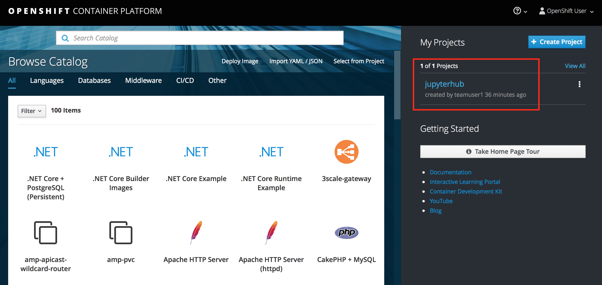
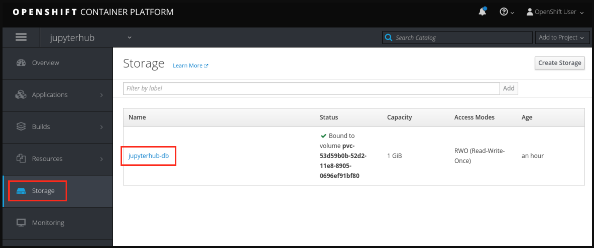
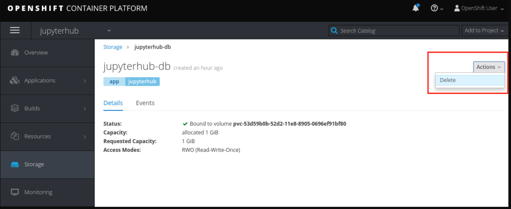

# Module - 2 : Setting up JupyterHub in OpenShift Container Platform

!!! Summary "Module Agenda"
    - **In this module you will be creating an OpenShift project for JupyterHub required for the rest of the sessions**

- From your workstation SSH into ``OpenShift Master Node`` with the user name **``cloud-user``** and ``SSH Private Key`` [(Need Help..Learn how to Login)](https://ksingh7.github.io/data-show/#accessing-the-lab)

```
chmod 400 <path to ssh_key.pem>
ssh -i <path to ssh_key.pem> cloud-user@<OpenShift Master Node SSH IP Address>
```  

!!! example "Prerequisite"
    - You must run all the commands logged in as user **cloud-user** on the **OpenShift Master Node** node, unless otherwise specified. 

## Create an OpenShift Project

In order to save your precious lab time, OpenShift Container Platform has already been installed and configured. Before you begin with some data science exercises, let's create an OpenShift project.

- SSH into OpenShift Master Node as ``cloud-user``

```
ssh -i <path to ssh_key.pem> cloud-user@<OpenShift Master Node IP Address>
```

- Login to OpenShift

```
oc login -u teamuser1 -p openshift
```

- Create a new project

```
oc new-project jupyterhub
```

- Prepare the OpenShift notebooks and templates

```
oc apply -f https://raw.githubusercontent.com/vpavlin/jupyterhub-ocp-oauth/ceph-summit-demo/notebooks.json
```

```
oc apply -f https://raw.githubusercontent.com/vpavlin/jupyterhub-ocp-oauth/ceph-summit-demo/templates.json
```

- Process the template to deploy the JupyterHub application

```
oc process jupyterhub-ocp-oauth HASH_AUTHENTICATOR_SECRET_KEY="meh" | oc apply -f -
```

- Once templates are successfully applied, the output should look like this

```
imagestream "jupyterhub-img" created
buildconfig "jupyterhub-img" created
configmap "jupyterhub-cfg" created
serviceaccount "jupyterhub-hub" created
rolebinding "jupyterhub-edit" created
deploymentconfig "jupyterhub" created
service "jupyterhub" created
route "jupyterhub" created
persistentvolumeclaim "jupyterhub-db" created
deploymentconfig "jupyterhub-db" created
service "jupyterhub-db" created
```

- You should now have JupyterHub pods and services coming up (will take some time to fully start). 
- To check the status of pods and services, execute

```
oc get pods
```

- The deployment is complete when the jupyterhub-db and jupyter pods are fully running and the output should look like this.

```
$ oc get pods
NAME                     READY     STATUS    RESTARTS   AGE
jupyterhub-db-1-deploy   1/1       Running   0          19s
jupyterhub-db-1-zkmxc    0/1       Running   0          17s
jupyterhub-img-1-build   1/1       Running   0          20s
```


- You could also monitor your application from OpenShift Container Platform Console by visiting ``OpenShift Web Console URL`` that you can get from [Qwiklab Portal under Connection Details](https://ksingh7.github.io/data-show/#wait-for-lab-provisioning-to-complete).

- The user name and password to access the console is ``teamuser1`` and ``openshift`` respectively.


- Once you are into OpenShift Container Platform Console, click on your project ``jupyterhub``



- The running pods should look like this when JupyterHub is ready


- Verify you can access your JupyterHub application by visiting the application URL


- (optional) You can also get your JupyterHub application URL by executing the below command on OpenShift Master Node.

```
echo "https://"$(oc get route jupyterhub -o jsonpath={.spec.host})
```

- Finally, log into JupyterHub by using the user name and password ``user1`` and ``79e4e0`` respectively.


## Troubleshooting the JupyterHub deployment

#### Issue - 1 : Database not properly installed

Sometimes the JupyterHub deployment to OpenShift runs into race conditions, that could trigger ``Recreate Deployment``


- The jupyterhub-db pod never comes up and constantly restarts.  This is often due to the PostgreSQL database not coming up cleanly.  If this occurs, the easiest thing to do is delete the jupyterhub-db persisted volume and rerun the oc process command.

- Delete the persisted volume:





- Rerun oc process command:

```
oc login -u teamuser1 -p openshift
```

```
oc process jupyterhub-ocp-oauth HASH_AUTHENTICATOR_SECRET_KEY="meh" | oc apply -f -
```

- Wait for the pods to come up cleanly:


#### Issue - 2 : 500 Internal Error when logging into JupyterHub

- You receive a ``500 Internal Error``.  Do another deployment/rollout of JupyterHub which forces a restart of the server container and after connecting again to database.

```
oc rollout latest jupyterhub
```

!!! summary "End of Module"
    **We have reached to the end of Module-2. At this point you have learned how to deploy an application on OCP. In the later modules we will use this application to perform some interesting Data Analytics and Machine Learning tasks**
